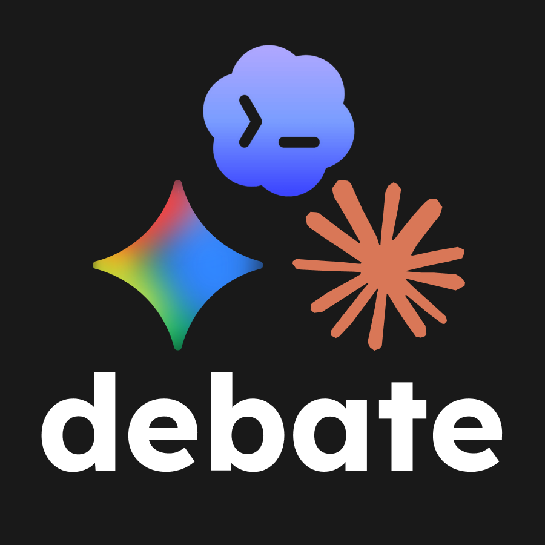

# Agent Debate

Agent Debate is a local-first debate room for comparing answers from multiple AI coding agents. It runs installed CLI agents such as Gemini, Claude, and Codex — or any OpenAI-compatible API endpoint such as Ollama — from the same project folder, streams the debate into a browser UI, and saves each transcript as Markdown.

The app is designed for maintainers who want a fast second opinion before changing code, APIs, design-system contracts, or project direction.



## Highlights

- Run a structured 3-round debate across enabled agents.
- Connect your own agents from the UI or `agent-debate.config.json`: local CLI commands or OpenAI-compatible API endpoints (Ollama, OpenAI, OpenRouter, and similar).
- Keep provider credentials out of the app: CLIs use their own login flows, and API agents read keys from your shell environment.
- Save local Markdown transcripts under `runs/`.
- Run a self-contained UI (plain HTML, CSS, and Node.js) that works on a fresh clone and can optionally be themed with your own design system.

## Requirements

- Node.js 20 or newer.
- At least one authenticated agent CLI on your `PATH`, or an OpenAI-compatible API endpoint (for example a local Ollama server).
- macOS, Linux, or another environment that can run Node child processes.

Agent Debate never stores API keys. CLI agents authenticate through their own official setup flows. API agents store only the name of an environment variable; the key is read from your shell when a debate runs and is never written to disk.

## Quick Start

```bash
git clone https://github.com/nanacodesign/agent-debate.git
cd agent-debate
cp agent-debate.config.example.json agent-debate.config.json
npm run dev
```

Then open:

```text
http://127.0.0.1:4177
```

You can also run without a copied config file. In that case, the app starts with default Gemini, Claude, and Codex CLI definitions.

## Connect Agents

Open **Agent Connections** in the app and add or edit each agent. Two connection types are supported.

### CLI command

Runs a local executable, such as the official `codex`, `claude`, or `gemini` CLIs.

- `Name`: label shown in the debate UI.
- `Command`: executable name, for example `codex`, `claude`, or `gemini`.
- `Arguments JSON`: JSON array of CLI arguments.
- `Input mode`: how the debate prompt is passed to the command.
- `Enabled`: whether this agent should participate.

Supported input modes:

- `stdin`: send the prompt to standard input.
- `stdin-last-message-file`: send the prompt to standard input and append the last agent output file path.
- `none`: do not send stdin. Use `{prompt}` or `{outputFile}` placeholders in arguments instead.

Argument placeholders:

- `{prompt}` is replaced with the generated debate prompt.
- `{outputFile}` is replaced with the temporary file path where the agent output should be written.

### API endpoint

Calls any OpenAI-compatible chat completions endpoint directly — no wrapper script or extra install. This covers Ollama, LM Studio, OpenAI, OpenRouter, Groq, and most other providers. Presets for Ollama, OpenAI, and OpenRouter fill the fields for you.

- `Name`: label shown in the debate UI.
- `Base URL`: OpenAI-compatible base URL, usually ending in `/v1`. The app calls `{baseUrl}/chat/completions`.
- `Model`: model name the endpoint serves.
- `API key env var`: name of the environment variable that holds the API key. Leave empty for local endpoints like Ollama.
- `Enabled`: whether this agent should participate.

Export the key in the same shell before starting the app:

```bash
export OPENAI_API_KEY="sk-..."
npm run dev
```

Example:

```json
{
  "agents": [
    {
      "id": "codex",
      "name": "Codex",
      "command": "codex",
      "args": ["exec", "--skip-git-repo-check", "--ephemeral", "--color", "never", "-"],
      "input": "stdin",
      "enabled": true
    },
    {
      "id": "ollama",
      "name": "Ollama",
      "type": "api",
      "baseUrl": "http://127.0.0.1:11434/v1",
      "model": "llama3.3",
      "apiKeyEnv": "",
      "enabled": true
    }
  ]
}
```

For details on API agents, plus wrapper scripts for services without an OpenAI-compatible endpoint, see [Connecting Custom Agents](docs/connecting-custom-agents.md).

## Environment

Optional environment variables:

```bash
AGENT_DEBATE_HOST=127.0.0.1
AGENT_DEBATE_PORT=4177
AGENT_DEBATE_DEFAULT_PROJECT_PATH=/path/to/project
AGENT_DEBATE_EXTRA_PATHS=/custom/bin:/another/bin
NANAOS_DESIGN_SYSTEM_PATH=/path/to/design-system
```

## Theming

Agent Debate ships with a built-in, self-contained theme (`public/theme.css`, plus open-licensed Geist fonts and a small Material Symbols subset under `public/vendor/`), so the UI works out of the box with no external assets.

If you maintain your own design system, point `NANAOS_DESIGN_SYSTEM_PATH` at its build directory. Matching CSS, fonts, and icons are then served under `/nanaos/` and override the built-in theme. The override is layered with CSS cascade layers so a mounted design system always wins locally, while a fresh clone falls back to the neutral built-in theme automatically.

## Local Files

- `agent-debate.config.json` stores your local agent setup and is ignored by Git.
- `runs/*.md` stores local debate transcripts and is ignored by Git.
- `public/assets/debate.png` is the app mark.

## Safety Notes

Agent Debate executes local commands that you configure. Only connect CLIs you trust, and review the project path before starting a debate. The app binds to `127.0.0.1` by default so it is not exposed on your network unless you opt into another host.

API agents send the debate prompt (topic, imported context, and the running transcript) to the endpoint you configure. With local endpoints such as Ollama everything stays on your machine; with cloud providers the prompt leaves your machine under that provider's terms.

Because agents run as local shell commands, exposing the server to a network (for example by setting `AGENT_DEBATE_HOST` to `0.0.0.0`) effectively offers unauthenticated code execution to anyone who can reach it. Keep the default host unless you fully trust the network. State-changing requests from other web origins are rejected to protect against cross-site (CSRF) attacks. See [SECURITY.md](SECURITY.md) for details.

## OpenAI Codex for OSS

This project is being prepared as an open-source local tool for maintainers and contributors. If you are applying for OpenAI's Codex for OSS support, the public repository URL, maintainer role, OpenAI organization ID, and intended API-credit usage plan are the core details requested in the application form.

## License

MIT
